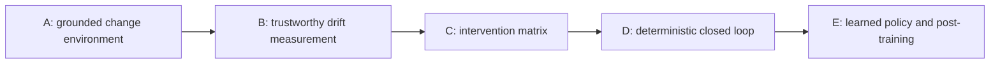

# Project DELTA roadmap

This is the only delivery/status roadmap for Project DELTA. The system contract is
defined in [project-delta.md](./project-delta.md).

## invariant

```text
A phase is complete only when its exit artifact exists and can be reproduced.
Later modules do not compensate for an untrusted dataset or verifier.
Status describes repository reality, not intent.
```

## current position

```text
Phase A — grounded change environment: in progress
```

The execution platform is ahead of the DELTA loop: dispatch, B2 manifests,
disposable workers, LoRA training, and adapter reload exist. They are prerequisites,
not evidence that drift detection, policy selection, or promotion exists.



## Phase A — grounded change environment

**Goal:** turn `repo + old revision + new revision` into provenance-bearing corpora,
a structural diff, typed train candidates, and held-out eval candidates.

**Implemented:**

- pinned vLLM v0.22.0/v0.23.0 snapshots;
- chunked corpora on B2;
- corpus inspection and gold validation;
- 40-row hand-authored `eval_v2`.

**Missing:**

- generic repository/tag input contract;
- structural index and typed T1–T7 generators;
- contamination, deduplication, and balance gates;
- `eval_v3` classes A–D;
- Q&A-aligned doc_0 training data.

**Exit artifact:**

```text
DatasetManifest + train JSONL + eval JSONL + rejected JSONL
```

The manifest binds source revisions, corpus hashes, recipe hash, generator
versions, class counts, and rejection reasons.

## Phase B — trustworthy drift measurement

**Goal:** quantify and localize model drift using corpus changes plus behavioral
evidence.

**Required work:**

- harden failure-mode scoring;
- add version attribution and correct abstention scoring;
- measure stable-knowledge regressions separately from changed knowledge;
- add executable tests for procedural/API behavior;
- emit a versioned `DriftEvent`.

**Exit artifact:**

```text
DriftEvent + reproducible baseline report
```

The first credible result is c0 versus c3 on a frozen eval with aligned train data.
It is not an aggregate substring score.

## Phase C — intervention matrix

**Goal:** measure quality recovery, regression, latency, and cost for each available
intervention.

**Required work:**

- context-injection condition;
- fresh/stale/shuffled retrieval indexes and eval paths;
- doc_0 LoRA condition;
- LoRA plus fresh retrieval;
- one comparison report with per-class failure modes and costs.

**Exit artifact:**

```text
InterventionOutcome[] covering L0-L3
```

Interventions are selected manually in this phase. That is intentional: policy
learning without outcome data is fiction.

## Phase D — deterministic closed loop

**Goal:** execute SENSE → BUILD → DECIDE → VERIFY without human construction of
evidence.

**Required work:**

- upstream revision trigger;
- threshold-based least-cost policy;
- candidate-state registry;
- quality and regression promotion gates;
- immutable decision record;
- active-state pointer and rollback.

**Exit artifact:**

```text
one end-to-end reconcile run that promotes or rejects automatically
```

## Phase E — learned policy and post-training

**Goal:** learn intervention selection from accumulated outcomes and evaluate
whether execution-reward post-training helps at sub-1B scale.

**Required work:**

- policy dataset from Phase C/D outcomes;
- held-out drift episodes;
- deterministic policy baseline;
- GRPO or equivalent with executable reward;
- cost-aware policy evaluation;
- model-size ablation.

**Exit artifact:**

```text
learned policy beats deterministic baselines on held-out drift episodes
without violating quality or regression constraints
```

## publication checkpoints

Dates are planning inputs, not system milestones.

| target | status as of 2026-07-18 | required evidence |
|---|---|---|
| NeurIPS 2026 workshop contribution | suggested date 2026-08-29; workshop-specific deadlines vary | Phase A plus a credible Phase B result |
| arXiv systems report | no fixed deadline | Phases A–C with reproducible artifacts |
| MLSys 2027 | expected around late Oct 2026; official deadline not yet recorded here | deterministic closed loop plus systems evaluation |

Do not copy these dates into experiment documents. Update this table only after
checking the official venue.

## what goes where

- Phase status and exit artifacts: this document.
- System invariants and module interfaces: `docs/project-delta.md`.
- Experiment-specific execution state: its charter and harness README.
- Evidence changing a phase status: frozen datasets, reports, and run artifacts.

## what can die

- calendar plans that no longer match evidence;
- planned interventions that do not improve the quality/cost frontier;
- intermediate candidate datasets and local run caches.

## what must survive

- phase exit artifacts and their manifests;
- negative results and rejected promotion decisions;
- the evidence used to change a phase status.

## command

Current Phase A commands:

```bash
python experiments/e1_vllm/build_corpus.py
python experiments/e1_vllm/inspect_data.py stats
python experiments/e1_vllm/inspect_data.py validate-eval eval_v2.jsonl
```

No phase should be marked complete solely because these commands exit zero.
