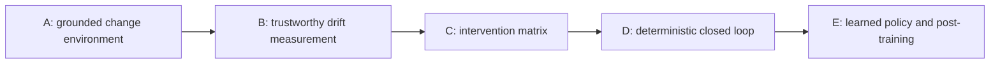

# Project DELTA roadmap

This is the only delivery/status roadmap for Project DELTA. The system contract is
defined in [project-delta.md](./project-delta.md).

## invariant

```text
A phase is complete only when its exit artifact exists and can be reproduced.
Later modules do not compensate for an untrusted dataset or verifier.
Status describes repository reality, not intent.
```

## current position

```text
Phase A — grounded change environment: complete (e1_vllm vertical slice)
Phase C — intervention matrix:         complete (e1_vllm, manual selection)
Phase B — trustworthy drift measurement: partial (DriftEvent v1 + baseline)
TopicKnowledgeProfile — dense v1 locked (meanings+honesty; docs-grounded)
Profile→adapt LoRA — frozen at seq v7; further FT paused
Phase D — deterministic closed loop: partial (control plane + replay implemented;
                                           sealed end-to-end exit still open)
```

Phase C ran ahead of Phase B on purpose for `e1_vllm`: the intervention matrix
needed frozen eval + conditions before a typed `DriftEvent` existed. Phase B now
has a behavioral `DriftEvent` + baseline report; full exit still needs corpus
structural signal and executable probes.

**Locked profile→adapt result (2026-07-28):** on Qwen3.5-0.8B / v0.22.0, a
docs-grounded meanings+honesty profile finds a real hole (chance recognition,
acquiescent false-accept). A profile wheel LoRA (v5) repairs that manifold and
survives paraphrase holdout; it does **not** transfer to `eval_v3`. Sequential
stage-2 from v5 (`e1-vllm-c3-ft-seq-v7-*`, `train_v0.22.0_v7`) is the frozen
checkpoint: ~41% `eval_v3` with paraphrase false-reject ~97%. Flat blend v6
raises `eval_v3` further but wrecks honesty — do not promote v6 as the honesty
adapter. Full-weight FT deferred; LoRA FT paused.

The execution platform (dispatch, B2, Modal/Lambda, LoRA train/reload) remains a
prerequisite, not proof that SENSE → DECIDE → VERIFY is closed.



Note: dependency order above is the system order. Empirical work on `e1_vllm`
produced Phase C evidence before Phase B’s exit artifact.

## Phase A — grounded change environment

**Goal:** turn `repo + old revision + new revision` into provenance-bearing corpora,
a structural index, typed train candidates, and held-out eval candidates.

**Status:** complete for `e1_vllm`.

**Implemented (evidence):**

- pinned vLLM v0.22.0 (`doc_0`) / v0.23.0 (`doc_8`) via mill `pin`;
- chunked corpora on B2;
- `structure_index.json` + mill generators **T1–T7**;
- gate: eval denylist, dedupe, grounding checks; rejected JSONL;
- `eval_v3` (A–D) + validation tooling;
- Q&A-aligned doc_0 train sets (`train_v0.22.0_v{3,4}.jsonl` + manifests).

**Still not claimed (out of Phase A exit):**

- multi-experiment generic mill in `src/lab/` (still under `experiments/e1_vllm/mill/`);
- recipe-driven class balance beyond T7 candidate cap;
- automatic structural *diff* product (two-tag delta / T8).

**Exit artifact (present):**

```text
DatasetManifest + train JSONL + eval JSONL + rejected JSONL
```

Concrete: `data/experiments/e1_vllm/manifest_v0.22.0_v4.json`, matching train/eval
JSONL, mill `gated/rejected.jsonl`, frozen `eval_v3.jsonl` on B2.

## Phase B — trustworthy drift measurement

**Goal:** quantify and localize model drift using corpus changes plus behavioral
evidence.

**Status:** partial — DriftEvent v1 + baseline report exist and the factory
corpus signal is attached; executable probes and schema freeze remain open.

**Have:**

- c0 vs c3 and c0 vs c1 typed `DriftEvent` JSON (behavioral, rescored labels);
- baseline report separating stable (A) vs changed (B/D) deltas;
- structural doc_0↔doc_8 `corpus_signal` from the sealed
  `e1_eval_factory_v1` claim census;
- hardened failure modes: `confident_hallucination` for unknown-gold misses;
  shared scorer in `src/lab/qa_score.py`.

**Still required for full exit:**

- executable tests for procedural/API behavior where possible;
- freeze DriftEvent schema beyond `delta.drift_event.v1` after one more iteration.

**Related (feeds DECIDE / BUILD, not Phase B exit alone):**

- closed-book dense `TopicKnowledgeProfile` on source_before (v0.22.0 / `doc_0`):
  85 code-verified meaning claims, 996 probes, protocol
  `e1_profile_meaning_honesty_v1` under `experiments/e1_vllm/knowledge_profile/`;
- TruthSource v2: docs-only sufficient for shared bridge meanings (code arms
  deferred);
- frozen adapt checkpoint: seq v7 LoRA from profile v5 + eval-hole paraphrases
  (`manifest_v0.22.0_v7.json`); reports under `artifacts/reports/topic_knowledge_profile_*`;
- frozen `delta.eval_environment.v1` for v0.22.0→v0.23.0:
  `datasets/experiments/e1_vllm/eval_factory/v0.22.0_to_v0.23.0/e1_eval_factory_v1/`
  (1,070 executable claims, 42 deltas, 623 eval probes);
  base 0.8B / 4B instrument checks:
  `artifacts/reports/eval_factory_v1_base_08b.md`,
  `artifacts/reports/eval_factory_v1_base_4b.md`
  (changed-contract score = 0 on both; 4B lower overall than 0.8B).

**Exit artifact:**

```text
DriftEvent + reproducible baseline report
```

Present (behavioral v1):

```text
artifacts/reports/drift_events/drift_c0_base_to_c3_ft.json
artifacts/reports/drift_events/drift_c0_base_to_c1_rag_fresh.json
artifacts/reports/e1_vllm_drift_baseline.md
```

Generator: `experiments/e1_vllm/sense_drift.py`.

## Phase C — intervention matrix

**Goal:** measure quality recovery, regression, latency, and cost for each available
intervention.

**Status:** complete for `e1_vllm` (manual intervention selection).

**Implemented (evidence):**

- context injection via BM25 retrieval path;
- fresh (`doc_8`), stale (`doc_0`), and shuffled retrieval conditions;
- doc_0 LoRA (mill v3/v4) and LoRA + fresh RAG (c4);
- comparison report: `artifacts/reports/e1_vllm_failure_modes.md` (on B2).

**Headline locked result:** fresh BM25 (c1) beats stale RAG, LoRA@doc_0, and
shuffle; c4 LoRA+RAG interferes. See the report for A/B/C/D and failure counts.

**Exit artifact (present for this slice):**

```text
InterventionOutcome evidence covering no-op / fresh RAG / stale RAG / LoRA / LoRA+RAG / shuffle
```

Formal `InterventionOutcome[]` schema + automatic selection remain Phase D inputs,
not a reason to reopen Phase C for `e1_vllm`.

## Phase D — deterministic closed loop

**Goal:** execute SENSE → BUILD → DECIDE → VERIFY without human construction of
evidence.

**Status:** **partial**. The deterministic controller and replay path are
implemented. The first recorded multi-release run used an unsealed seed bank,
so it is diagnostic evidence and does not satisfy the Phase D exit.

**Implemented:**

- `./scripts/delta reconcile --repo ... --from ... --to ...`;
- versioned `DriftEvent`, `InterventionPlan`, `CandidateState`,
  `InterventionOutcome`, `PromotionDecision`, and `ActiveState` contracts;
- deterministic least-cost policy with FT frozen by default;
- quality, regression, coverage, cost, and provenance gates;
- immutable local state/decision registry, explicit approval, active pointer,
  and rollback;
- bounded worker envelopes for surface wording and decision explanations.

**Boundary:** promotion-capable reconcile requires a sealed factory environment
and complete child-run evidence. `--target seed-replay` is an explicit
diagnostic override; VERIFY adds a failing `environment_sealed` gate so that
seed evidence can never promote. Extending plugin coverage does not change the
deterministic contracts, policy, gates, approval, or rollback semantics.

**Exit artifact:**

```text
one end-to-end reconcile run that promotes or rejects automatically
```

Diagnostic evidence (does **not** satisfy exit):
`artifacts/delta/reconciles/reconcile-ff7d7514f4c24cc9/receipt.json`
replays the unsealed v0.22.0→v0.26.0 seed bank and rejects the hybrid candidate
on the recovery gate while preserving the active pointer.

**Still required for full exit:**

- one non-dry reconcile over a sealed transition;
- automatic promotion or rejection with the seal, recovery, stable-regression,
  coverage, cost, and provenance gates recorded;
- active-pointer preservation on rejection or explicit approval on promotion.

## Phase E — learned policy and post-training

**Goal:** learn intervention selection from accumulated outcomes and evaluate
whether execution-reward post-training helps at sub-1B scale.

**Status:** not started.

**Required work:**

- policy dataset from Phase C/D outcomes;
- held-out drift episodes;
- deterministic policy baseline;
- GRPO or equivalent with executable reward;
- cost-aware policy evaluation;
- model-size ablation.

**Exit artifact:**

```text
learned policy beats deterministic baselines on held-out drift episodes
without violating quality or regression constraints
```

## publication checkpoints

Dates are planning inputs, not system milestones.

| target | status as of 2026-07-18 | required evidence |
|---|---|---|
| NeurIPS 2026 workshop contribution | suggested date 2026-08-29; workshop-specific deadlines vary | Phase A (done) + credible Phase B `DriftEvent` |
| arXiv systems report | no fixed deadline | Phases A–C with reproducible artifacts (A+C done for e1; B still open) |
| MLSys 2027 | expected around late Oct 2026; official deadline not yet recorded here | deterministic closed loop plus systems evaluation |

Do not copy these dates into experiment documents. Update this table only after
checking the official venue.

## what goes where

- Phase status and exit artifacts: this document.
- System invariants and module interfaces: `docs/project-delta.md`.
- Experiment-specific execution state: its charter and harness README.
- Evidence changing a phase status: frozen datasets, reports, and run artifacts.

## what can die

- calendar plans that no longer match evidence;
- planned interventions that do not improve the quality/cost frontier;
- intermediate candidate datasets and local run caches.

## what must survive

- phase exit artifacts and their manifests;
- negative results and rejected promotion decisions;
- the evidence used to change a phase status.

## command

Reproduce Phase A / C evidence for `e1_vllm`:

```bash
python experiments/e1_vllm/build_corpus.py
python experiments/e1_vllm/inspect_data.py validate-eval eval_v3.jsonl
python experiments/e1_vllm/mill/cli.py build \
  --repo https://github.com/vllm-project/vllm.git \
  --tag v0.22.0 \
  --eval-denylist experiments/e1_vllm/fixtures/eval_v3.jsonl \
  --version 4
python experiments/e1_vllm/build_index.py \
  --corpus data/experiments/e1_vllm/corpus_doc_8.jsonl \
  --out data/experiments/e1_vllm/indexes/doc_8_bm25.json
python experiments/e1_vllm/compare.py --metrics-dir /path/to/metrics \
  --out artifacts/reports/e1_vllm_failure_modes.md
python experiments/e1_vllm/sense_drift.py --metrics-dir /path/to/metrics
```

No phase should be marked complete solely because these commands exit zero.
