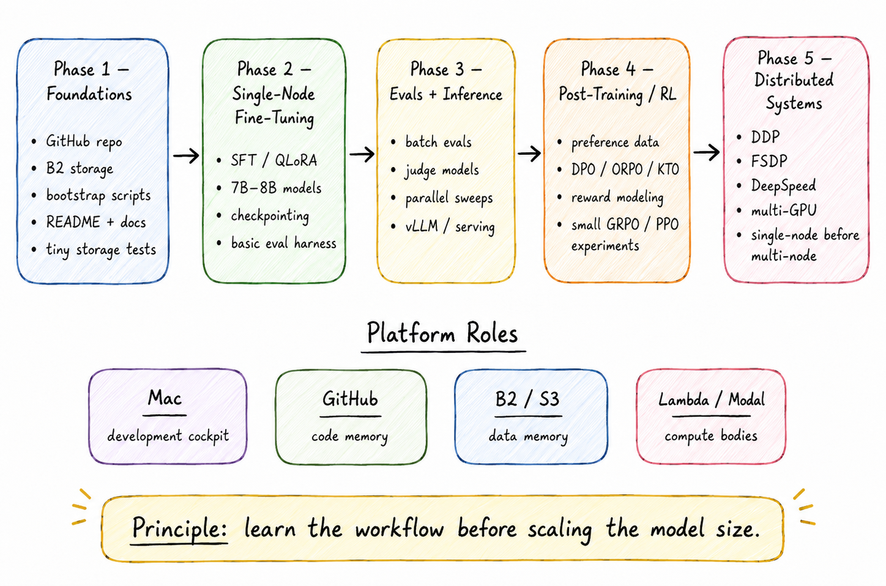

# phases

Order matters. No distributed RL before file movement works.



## phase 1 — foundations

Make the lab reproducible.

Success:

```text
Fresh machine can clone repo, configure .env, and read/write B2.
```

No GPU required.

## phase 2 — single-node fine-tuning

SFT, LoRA, QLoRA on 1B–8B models with checkpointing and basic evals.

Success:

```text
Train -> checkpoint -> upload -> reload -> eval.
```

If reload does not work, checkpointing does not work.

## phase 3 — evals + inference

Eval runner, batch inference, judge-model flow, result JSONL, comparison reports.

Success:

```text
Every checkpoint gets evaluated the same way.
```

## phase 4 — post-training / RL

Preference data, DPO, ORPO, KTO, reward modeling, small GRPO/PPO experiments.

Needs phases 1–3 or it becomes chaos.

Success:

```text
generate -> score/rank -> train -> eval -> compare
```

## phase 5 — distributed systems

DDP, FSDP, DeepSpeed. Order: single GPU → single-node multi-GPU → multi-node.

Success: measured throughput and scaling efficiency, not cross-region latency cosplay.
