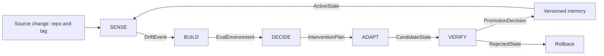

# Project DELTA — CI/CD for model knowledge

Project DELTA keeps a small expert model correct as its source of truth changes.

Software CI/CD turns code changes into tested deployments or rollbacks. DELTA turns
world changes into measured drift, the least-cost effective intervention, and a
verified model-state transition.

```text
world changes → SENSE → BUILD → DECIDE → VERIFY → promote or rollback
```

## invariant

```text
Ground truth is versioned and reproducible.
Every intervention is evaluated against the same affected knowledge.
No model state is promoted without measured recovery and regression checks.
The cheapest intervention that satisfies the quality constraint wins.
Workers can die; source, datasets, decisions, and promoted state must survive.
```

“Automatic” means a new source version can traverse the loop without a person
writing questions, selecting an intervention, or deciding whether to promote it.
Human approval may remain as a deployment control; it must not be required to
construct the evidence.

## design constraints

```text
Model scale     → sub-1B primary probe; larger models are ablations
Deployment      → CPU-viable inference is a first-class constraint
Ground truth    → executable when behavior can be run; corpus-grounded otherwise
Control plane   → automatic evidence construction and intervention selection
Optimization    → quality recovery subject to regression, latency, and cost
```

The primary systems quantity is not only whether knowledge drifted, but the
**drift rate**: how much affected behavior degrades per source change or unit time,
and how intervention cost grows with that rate.

## system contract



| module | responsibility | input | durable output |
|---|---|---|---|
| SENSE | detect, quantify, and localize knowledge drift | active model state, old source snapshot, new source snapshot | `DriftEvent` |
| BUILD | generate grounded train and eval environments for affected knowledge | `DriftEvent`, pinned source snapshots | `EvalEnvironment`, candidate train data |
| DECIDE | choose the least-cost intervention expected to recover quality | drift features, intervention history, budget and quality constraints | `InterventionPlan` |
| ADAPT | execute no-op, context, RAG refresh, LoRA, or later post-training | `InterventionPlan` | `CandidateState` |
| VERIFY | measure recovery, regressions, calibration, and cost | candidate, active state, eval environment | `PromotionDecision` |
| MEMORY | preserve lineage and resolve the active state | accepted decisions and artifacts | versioned adapters, indexes, manifests, active pointer |

ADAPT is execution, not a fifth research decision. DECIDE selects it; VERIFY
determines whether its output survives.

## module details

### SENSE

SENSE combines two signals:

1. **Corpus diff:** proactive evidence that the source of truth changed.
2. **Behavioral probes:** evidence that model behavior is now wrong.

Its output must identify:

```yaml
drift_event:
  source_before: {repo: ..., revision: ...}
  source_after: {repo: ..., revision: ...}
  drift_score: ...
  drift_type: added | removed | changed | moved
  affected_zones: [...]
  changed_claims: [...]
  probe_failures: [...]
```

A file diff alone is not model drift. A failed probe alone does not localize the
cause. DELTA needs both.

### BUILD

BUILD consumes a repository and pinned revisions. It creates:

- normalized, provenance-bearing corpora;
- a structural change index;
- typed training candidates;
- held-out eval candidates;
- executable tests where the source exposes runnable behavior;
- a manifest binding every row to source revisions and generator versions.

Teacher models may propose surface forms. They never define ground truth. A row
survives only if deterministic provenance, grounding, deduplication, and
contamination gates pass.

The dataset factory design belongs in the BUILD implementation. The active first
slice is documented in [e1_vllm](./experiments/e1_vllm.md).

### DECIDE

The intervention ladder is ordered by expected cost:

```text
L0 no-op
L1 prompt/context injection
L2 RAG index refresh
L3 LoRA delta adaptation
L4 continued pre-training or RL post-training
```

The policy objective is:

```text
minimize total intervention cost
subject to recovery >= quality threshold
and regression <= regression budget
```

The first policy will be deterministic and auditable. A learned policy is
justified only after DELTA has enough intervention outcomes to train and test it.

### VERIFY and MEMORY

VERIFY must answer:

1. Did affected knowledge recover?
2. Did stable knowledge regress?
3. Did calibration or abstention degrade?
4. Was the result worth its measured cost?

Substring matching is useful while bootstrapping dataset plumbing, but it is not
the target verifier. For technical behavior, executable tests are the preferred
ground truth.

MEMORY is git-like lineage, not a metaphorical vector store:

```text
active state
  ├── base model revision
  ├── adapter revision
  ├── retrieval index revision
  ├── source snapshot revision
  ├── eval environment revision
  └── promotion decision + metrics
```

Promotion updates an active pointer. Rejection leaves the prior pointer intact.
Rollback restores a previously accepted state without retraining.

## implementation boundary

This document defines the target contract, not implementation status. The
[DELTA roadmap](./delta-roadmap.md) is the sole owner of current capability state
and completion gates.

## what goes where

| artifact | location |
|---|---|
| DELTA invariant and module contracts | this document |
| delivery sequence and current status | `docs/delta-roadmap.md` |
| platform/storage mechanics | `docs/developer-workflow.md`, `docs/b2-tree.md` |
| experiment registry | `docs/experiments/README.md` |
| experiment hypothesis and matrix | `docs/experiments/{id}.md` |
| experiment code | `experiments/{id}/` |
| run configs | `configs/experiments/{id}/` |
| frozen datasets | B2 `datasets/experiments/{id}/` |
| run evidence | B2 `runs/{run_id}/` |
| accepted state lineage | B2 `states/{state_id}/` when implemented |

## documentation ownership

To prevent vision drift, each fact has one owner:

| fact | owner |
|---|---|
| system thesis and contracts | this document |
| DELTA phase status | `docs/delta-roadmap.md` |
| platform path conventions | `docs/developer-workflow.md` |
| storage layout | `docs/b2-tree.md` |
| active model and source revisions | experiment `snapshots.yaml` |
| experiment question and conditions | experiment charter |
| dataset statistics and validation | experiment data guide |
| runnable commands | harness/config README |

Leaf documents link to owners. They do not restate project phases, model IDs, or
system architecture.

## what can die

- workers, local clones, caches, candidate rows, rejected generations;
- failed run directories after their useful diagnostics are retained;
- intervention implementations that lose on quality/cost;
- early hand-authored eval drafts before a dataset version is frozen.

## what must survive

- source revisions and corpus hashes;
- dataset recipes, generator versions, manifests, and frozen evals;
- every promoted or rejected candidate's config, metrics, and decision;
- model/index/adapter lineage and the active-state pointer;
- the invariant and contracts in this document.

## command

The platform dispatcher executes individual experiment runs:

```bash
./scripts/lab run --target modal \
  --config configs/experiments/e1_vllm/c0_base_eval_qwen35_08b_modal.yaml
```

The DELTA control surface reconciles a source transition:

```bash
./scripts/delta reconcile \
  --repo https://github.com/vllm-project/vllm.git \
  --from <tag> \
  --to <tag> \
  --target replay
```

Capability status, supported experiment plugins, and the sealed-transition
completion gate live only in the [DELTA roadmap](./delta-roadmap.md).
