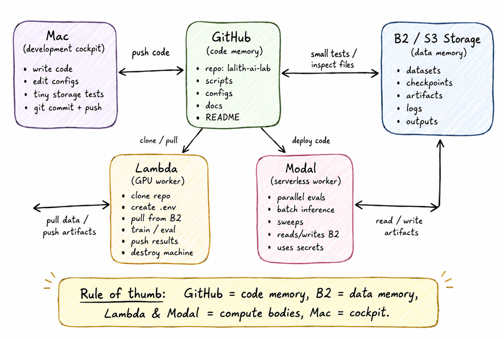

# the split

Use each thing for exactly one job.



This is the execution substrate for [Project DELTA](./project-delta.md), not the
DELTA system architecture.

## invariant

```text
Workers execute. GitHub and B2 preserve. The Mac coordinates.
```

## what goes where

| thing | job | keeps state? |
|---|---|---|
| Mac | cockpit | yes, temporarily |
| GitHub | code | yes |
| B2 / S3 | data | yes |
| Lambda | GPU worker | no |
| Modal | serverless worker | no |

## GitHub

Commit code, configs, docs, Dockerfiles, lockfiles, `.env.example`.

Not `.env`, secrets, datasets, weights, checkpoints, logs, outputs.

## B2 / S3

Datasets, checkpoints, adapters, eval outputs, logs worth keeping.

Durable storage — not a hot training filesystem or cache dump.

## Lambda

```text
launch -> clone -> .env -> check B2 -> pull data -> run -> push outputs -> terminate
```

If a Lambda machine dies and that is not fine, important state was stored in the wrong place.

Edited on Lambda? Push a branch. Don't leave fixes on the worker.

## Modal

Parallel evals, batch inference, sweeps, short independent jobs.

Use Modal Secrets, not `.env`.

## what can die

Lambda/Modal workers, local caches, and reproducible intermediate files.

## what must survive

Code and recipes in GitHub; datasets, run evidence, and accepted model state in
B2.

## command

```bash
bash scripts/check_storage.sh && bash scripts/test_storage_roundtrip.sh
```
